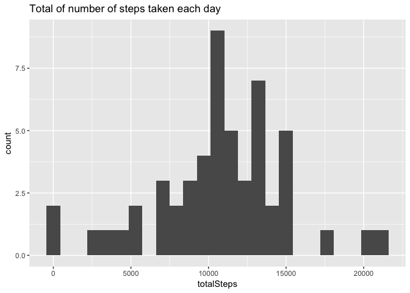
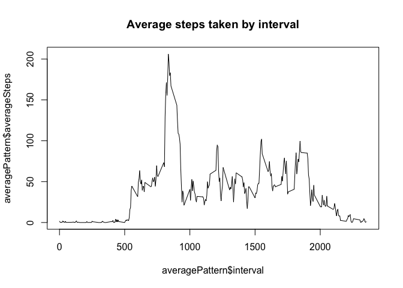
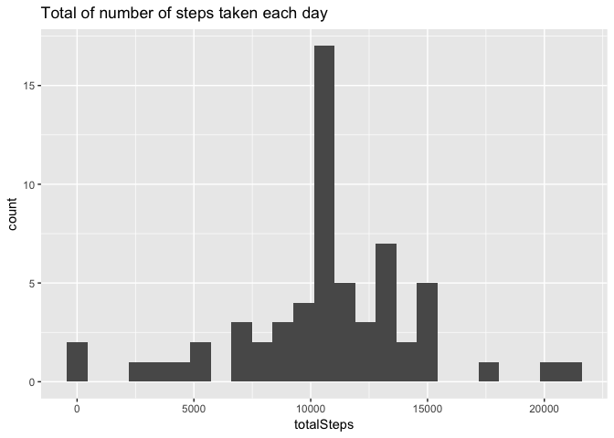
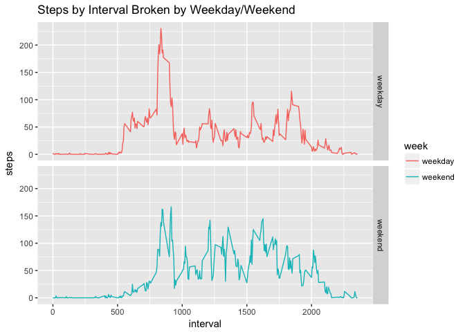

# Reproducible Research: Peer Assessment 1

## Loading and preprocessing the data
### 1. Load the data

```r
if(!file.exists("data.zip"))
    download.file("https://d396qusza40orc.cloudfront.net/repdata%2Fdata%2Factivity.zip", "data.zip", "curl")
if(!file.exists("activity.csv"))
    unzip("data.zip")
activity <- read.csv("activity.csv")
```
### 2. Process/transform data

```r
activityCleaned <- activity[!is.na(activity$steps),]
head(activityCleaned)
```

```
##     steps       date interval
## 289     0 2012-10-02        0
## 290     0 2012-10-02        5
## 291     0 2012-10-02       10
## 292     0 2012-10-02       15
## 293     0 2012-10-02       20
## 294     0 2012-10-02       25
```

## What is mean total number of steps taken per day?
### 1. Caclulate total number of steps taken per day

```r
sum(activityCleaned$steps)
```

```
## [1] 570608
```
### 2. Make histogram of total number of steps taken each day

```r
#Create histogram
library(ggplot2)
activityCleaned$date <- as.Date(activityCleaned$date)
totalByDay <- aggregate(activityCleaned$steps, by=list(activityCleaned$date), FUN=sum)
colnames(totalByDay) <- c("date", "totalSteps")
g <- ggplot(totalByDay, aes(x=totalSteps))
g + geom_histogram(bins=25) +  ggtitle("Total of number of steps taken each day")
```

<!-- -->

### 3. Report mean/median of total number of steps taken per day

```r
#Calculate the mean
mean(totalByDay$totalSteps)
```

```
## [1] 10766.19
```

```r
#Calculate the median
median(totalByDay$totalSteps)
```

```
## [1] 10765
```


## What is the average daily activity pattern?
### 1. Make a time series plot of the 5-minute interval and average number of steps taken

```r
averagePattern <- aggregate(activityCleaned$steps, by=list(activityCleaned$interval), FUN=mean)
colnames(averagePattern) <- c("interval", "averageSteps")
plot(averagePattern$interval, averagePattern$averageSteps, type="l", main="Average steps taken by interval")
```

<!-- -->

### 2. Which 5 minute interval contains maximum number of steps?

```r
averagePattern[which.max(averagePattern$averageSteps),]
```

```
##     interval averageSteps
## 104      835     206.1698
```

## Imputing missing values
### 1. Calculate and report the total number of missing values in the dataset (i.e. the total number of rows with 𝙽𝙰s)

```r
sum(is.na(activity$steps))
```

```
## [1] 2304
```

### 2. Devise a strategy for filling in all of the missing values in the dataset. The strategy does not need to be sophisticated. For example, you could use the mean/median for that day, or the mean for that 5-minute interval, etc.
I'll use the mean for that interval

### 3. Create a new dataset that is equal to the original dataset but with the missing data filled in.

```r
activityNa <- activity[is.na(activity$steps),]
activityNa <- merge(activityNa, averagePattern, by="interval")
activityNa$steps <- activityNa$averageSteps
activityNa <- activityNa[1:3]
activityFilled <- rbind(activityCleaned, activityNa)
```

### 4.Make a histogram of the total number of steps taken each day and Calculate and report the mean and median total number of steps taken per day. Do these values differ from the estimates from the first part of the assignment? What is the impact of imputing missing data on the estimates of the total daily number of steps?

```r
activityFilled$date <- as.Date(activityFilled$date)
filledTotalByDay <- aggregate(activityFilled$steps, by=list(activityFilled$date), FUN=sum)
colnames(filledTotalByDay) <- c("date", "totalSteps")
g <- ggplot(filledTotalByDay, aes(x=totalSteps))
g + geom_histogram(bins=25) +  ggtitle("Total of number of steps taken each day")
```

<!-- -->


```r
#Calculate the mean
mean(filledTotalByDay$totalSteps)
```

```
## [1] 10766.19
```

```r
#Calculate the median
median(filledTotalByDay$totalSteps)
```

```
## [1] 10766.19
```

The impact of imputing the missing data is that the mean stayed the same, but median rose by 1.19 steps.
## Are there differences in activity patterns between weekdays and weekends?

```r
activityFilled$weekday <- weekdays(activityFilled$date)
activityFilled$week <- ifelse(activityFilled$weekday == "Saturday" | activityFilled$weekday == "Sunday", "weekend", "weekday")
activityAggregateByWeek <- aggregate(activityFilled$steps, by=list(activityFilled$week, activityFilled$interval), mean)
colnames(activityAggregateByWeek) <- c("week", "interval", "steps")
```


```r
 g <- ggplot(activityAggregateByWeek, aes(x=interval, y=steps, color=week))
 g + geom_line() + facet_grid(week~ .) + ggtitle("Steps by Interval Broken by Weekday/Weekend")
```

<!-- -->


```r
 summary(subset(activityAggregateByWeek, week == "weekday")$steps)
```

```
##    Min. 1st Qu.  Median    Mean 3rd Qu.    Max. 
##   0.000   2.247  25.800  35.610  50.850 230.400
```

```r
 summary(subset(activityAggregateByWeek, week == "weekend")$steps)
```

```
##    Min. 1st Qu.  Median    Mean 3rd Qu.    Max. 
##   0.000   1.241  32.340  42.370  74.650 166.600
```

It looks like people take more steps overall on weekends. There is a larger spike during weekdays, probaby because most people go to lunch at the same time.
